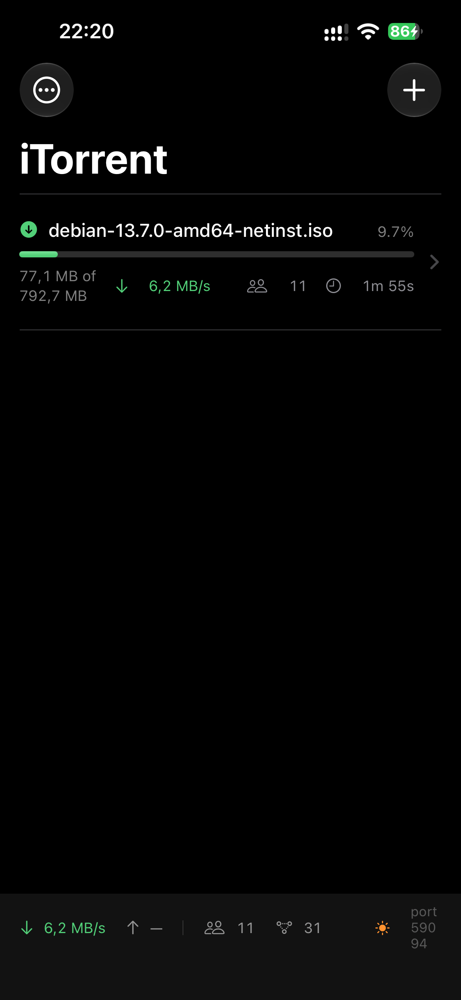
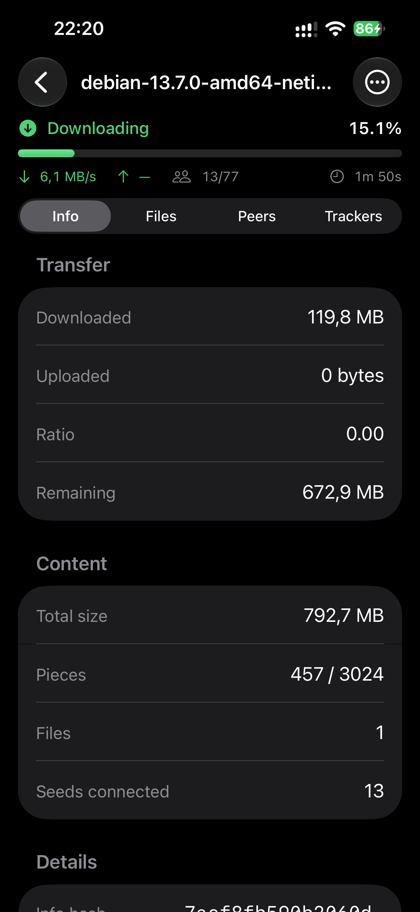
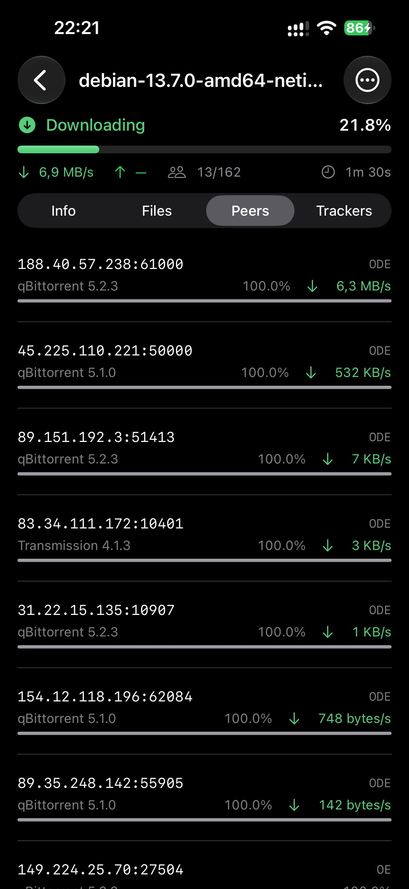
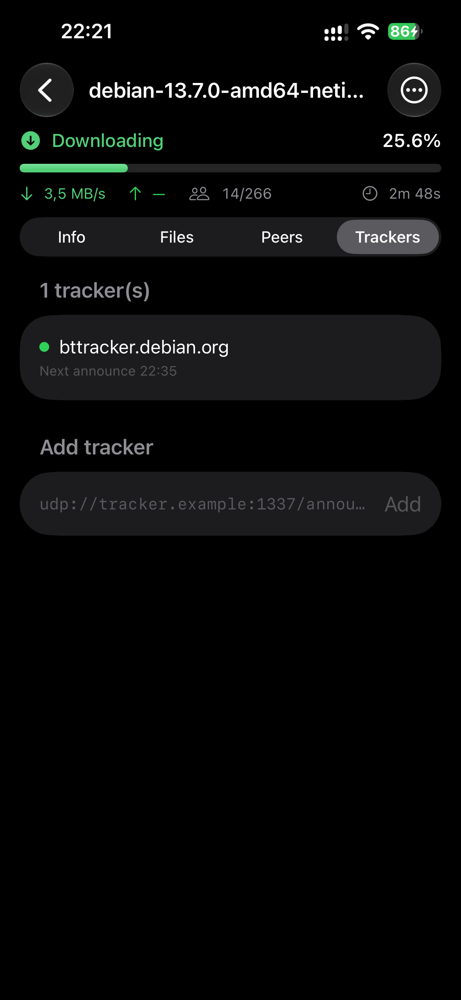
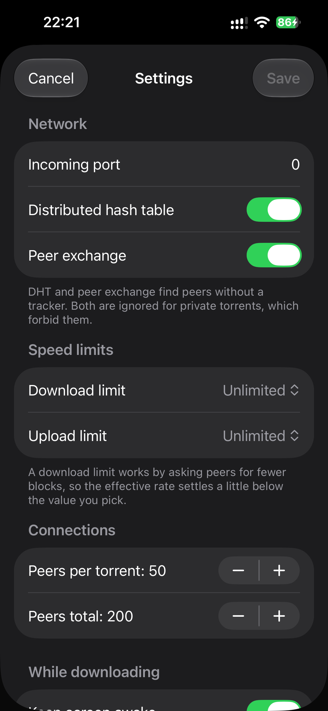

# iTorrent

A BitTorrent client for iOS, written from scratch in Swift. No libtorrent, no
C++, no third-party dependencies — the protocol stack is Swift and
Network.framework all the way down.

<p align="center">
  
  
  
</p>
<p align="center">
  
  
</p>

<p align="center">
  <em>Real device, real swarm: 792 MB of a Debian image pulled from qBittorrent
  and Transmission peers at 6.9 MB/s.</em>
</p>

```
torrenttracker/
├── TorrentKit/        Swift package: the engine (platform-agnostic, tested on macOS)
└── iTorrent/          SwiftUI iOS app
```

## Running it

```bash
# Engine tests (56 tests, includes real transfers over loopback)
cd TorrentKit && swift test

# The app
open iTorrent/iTorrent.xcodeproj      # then ⌘R
```

The project is set up for Jan's signing (team `3MB748S5UK`, bundle id
`cz.jannovy.iTorrent`). To build it on another machine or account, change
`DEVELOPMENT_TEAM` and `PRODUCT_BUNDLE_IDENTIFIER` in the iTorrent target's build
settings. A free Apple ID works too, but then the signature expires after seven
days.

```bash
# Install on a connected device
xcodebuild -project iTorrent/iTorrent.xcodeproj -scheme iTorrent -configuration Debug \
  -destination 'generic/platform=iOS' -allowProvisioningUpdates -derivedDataPath build
xcrun devicectl device install app --device <udid> build/Build/Products/Debug-iphoneos/iTorrent.app
```

## What it implements

| BEP | What | Where |
|-----|------|-------|
| 3 | Core protocol, bencode, peer wire, HTTP trackers | `Core/`, `Wire/`, `Tracker/` |
| 5 | Mainline DHT (client *and* server) | `DHT/` |
| 9 | Metadata exchange — magnet links | `Wire/ExtensionProtocol.swift` |
| 10 | Extension protocol | `Wire/ExtensionProtocol.swift` |
| 11 | Peer exchange (PEX) | `Wire/ExtensionProtocol.swift` |
| 12 | Multi-tracker announce lists | `Tracker/TrackerManager.swift` |
| 15 | UDP trackers | `Tracker/UDPTracker.swift` |
| 23 | Compact peer lists | `Wire/PeerAddress.swift` |
| 47 | Padding files | `Model/Metainfo.swift` |

Also: rarest-first piece selection with a random warm-up, endgame mode,
tit-for-tat choking with a rotating optimistic slot, per-file priorities and
skipping, SHA-1 verification of every piece, sparse file allocation, resume
data, seeding, speed limits, and inbound connections so the client is
reachable rather than connect-only.

Not implemented: BitTorrent v2 (`urn:btmh:`), µTP, protocol encryption,
WebTorrent/WSS trackers, web seeds, local peer discovery, and sequential
download.

## How it is put together

**`TorrentSession`** (actor) owns the peer id, the listening socket, the DHT
node, settings, and one **`TorrentTask`** per torrent. Each `TorrentTask`
(actor) owns its peers, its `PiecePicker`, its `TorrentStorage` and its
`TrackerManager`, and runs a one-second tick that expires stale requests,
tops up peer connections, announces, re-runs the choking algorithm and issues
block requests.

Three decisions are worth knowing about, because they are not the obvious ones:

**Peer framing runs on a serial `DispatchQueue`, not inside an actor.**
Network.framework delivers reads on its own queue, and hopping each chunk into
an actor with `Task {}` does not preserve order. A byte stream reordered by one
chunk is unrecoverable, so `PeerConnection` keeps its buffer on a serial queue
and publishes parsed messages through an `AsyncStream`, which *is* ordered.

**Torrents push snapshots; the UI never pulls.** The session used to call
`await task.snapshot()` for each torrent every second. Swift actors are not
FIFO, so during a fast download — where the torrent actor is saturated with
peer messages — that request was starved indefinitely and the torrent list
simply stopped updating while the download ran fine. Each task now writes its
snapshot to a lock-protected box at the end of its tick, and the session reads
it without an actor hop.

**No network call is allowed to block the torrent's tick.** Announces and DHT
lookups are started from the tick but run beside it. They used to be awaited
inline, and a UDP tracker that never answered would hang the tick — which is
what keeps peers connected and blocks flowing. One unreachable announce URL was
enough to freeze a torrent at zero peers with every tracker stuck on
"announcing". Anything built on Network.framework callbacks also needs
`withTaskCancellationHandler`: a task group waits for its children, so a
timeout around an uncancellable continuation hangs right along with it.

**An interrupted announce is not a tracker failure.** iOS tears down every
socket when it suspends the app, so a screen lock made all trackers fail at
once and buried each under an exponential backoff it never earned. Connection
teardown reports `TrackerError.interrupted`, which is retried in 20 seconds
instead of counting against the tracker, and returning to the foreground
re-announces everything immediately.

**Nothing announces before the listener has bound.** `NWListener` reports its
port asynchronously, so restoring torrents immediately after starting it meant
announcing `port=0` — trackers then handed our address to other peers with a
port nobody could dial, and every connection had to be one we opened ourselves.
The session waits for the port, and pushes it into every torrent (with a
re-announce) whenever it changes.

**The DHT uses a BSD socket, not `NWConnection`.** The DHT talks to thousands
of short-lived addresses from one local port; Network.framework models UDP as
a connection per remote endpoint, which would mean thousands of objects.

## Tests

`swift test` runs 56 tests. The ones that matter are in `TransferTests`: they
stand up two real sessions on real sockets and move a real torrent between
them over loopback — single-file, multi-file with pieces straddling file
boundaries, a magnet link resolving its metadata over `ut_metadata`, and a
resume from persisted state.

There is also a live smoke test against the public network, off by default
because it depends on strangers' upload slots:

```bash
ITORRENT_LIVE_TESTS=1 ITORRENT_LIVE_MAGNET='magnet:?xt=urn:btih:…' \
  swift test --filter downloadsFromRealSwarm
```

## Logging

```bash
xcrun simctl spawn booted log stream --level debug \
  --predicate 'subsystem == "dev.itorrent.torrentkit"'
```

Categories: `session`, `torrent`, `peer`, `tracker`, `dht`, `storage`.

## iOS specifics

- Downloads go to `Documents/Downloads` and are visible in Files under
  "On My iPhone → iTorrent" (`UIFileSharingEnabled`).
- Torrent data is excluded from iCloud backups; Apple rejects apps that back up
  re-downloadable content.
- ATS is disabled (`NSAllowsArbitraryLoads`) because most trackers are still
  plain HTTP and peer connections are raw TCP. Shipping this on the App Store
  would need a justification — for sideloading it is fine.
- `magnet:` links and `.torrent` files open the app.
- There is no background mode. iOS gives no legitimate background execution for
  this, so transfers stop when the app is suspended; state is flushed on the way
  out so nothing is lost.
- **Keep screen awake** (Settings, on by default) holds off the display's
  auto-lock while something is actually transferring, and releases it as soon as
  everything finishes. This is the only way to leave a download running: the app
  is suspended the moment the screen sleeps. Seeding deliberately does not hold
  the screen on. Pressing the side button still locks the phone and still stops
  the transfer. The status bar shows a sun icon whenever the lock is being held,
  so the behaviour is never a mystery.

## The icon

Generated, not hand-drawn, so it can be regenerated rather than being a binary
nobody can edit:

```bash
swiftc -O -parse-as-library Tools/GenerateAppIcon.swift -o /tmp/genicon
/tmp/genicon iTorrent/iTorrent/Assets.xcassets/AppIcon.appiconset/AppIcon.png
```

## Legal

BitTorrent is a transfer protocol and this is a general-purpose client. What you
download with it is your responsibility.
